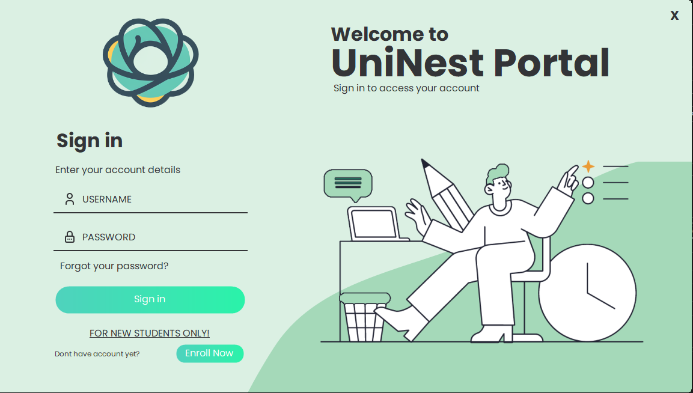
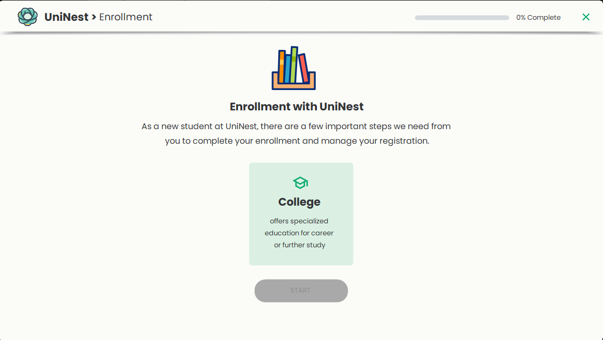
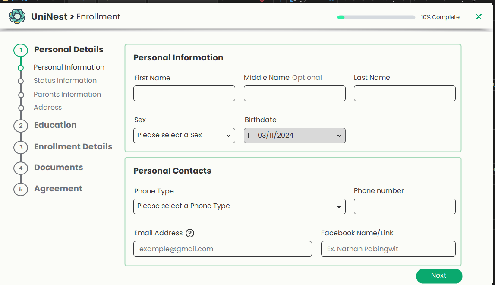
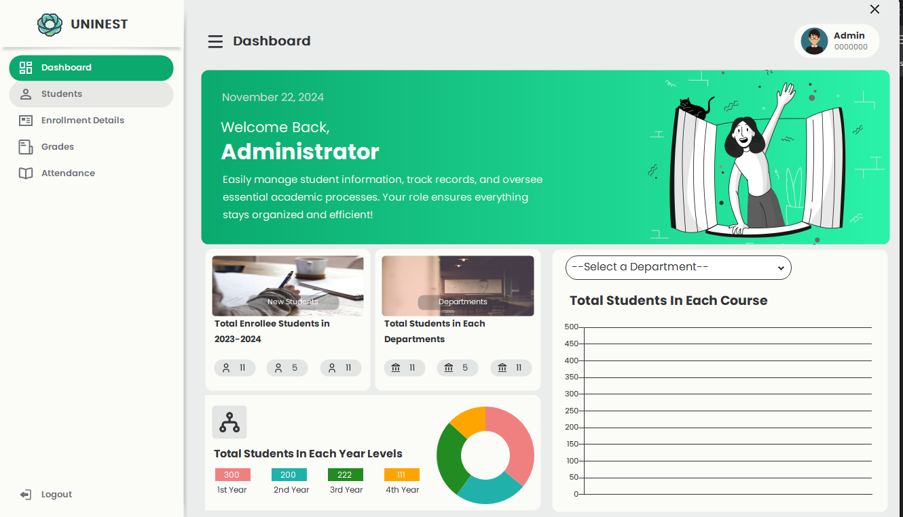

# UniNest 🎓

**UniNest** is a student enrollment system developed using C# Windows Forms as an academic project. It features a clean and modern UI, guiding new students through the enrollment process and providing an admin interface for managing student data.

## 🧩 Features

- 🔐 **Admin Login System**
- 📝 **Student Enrollment Wizard**
- 👤 **Manage Student Records (View/Edit/Delete)**
- 🎨 **Modern, User-Friendly Interface**

## 📸 Screenshots

### Login Screen


### Enrollment Interface



### Dashboard Interface


## 🛠️ Technologies Used

- C# (.NET Framework)
- Windows Forms
- Guna UI Framework (for styling)
- Visual Studio (IDE)

## 🚀 Getting Started

### Prerequisites

- Windows OS
- Visual Studio (recommended)
- .NET Framework installed

### Setup Instructions

1. Clone the repository:
   ```bash
   git clone https://github.com/zed-koba/UniNest.git
